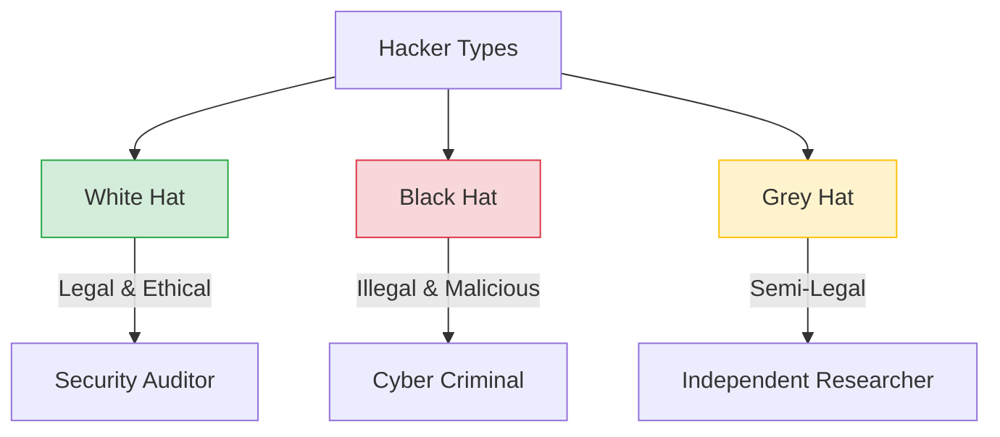
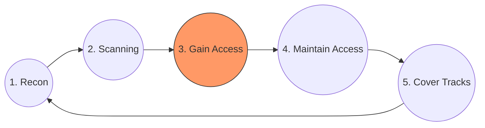

# 🛡️ Pertemuan 1: Pengenalan Ethical Hacking & Cybersecurity

**Tujuan:** Memahami konsep dasar ethical hacking, landasan hukum di Indonesia, serta menguasai dasar navigasi terminal untuk persiapan penetrasi sistem.

---

## 📚 Materi Teori

### 1. Definisi dan Peran Ethical Hacking
Ethical Hacking adalah aktivitas mengidentifikasi kelemahan (vulnerabilities) sistem dengan izin resmi.
- **Vulnerability**: Celah atau kelemahan pada sistem (misal: password lemah, bug software).
- **Exploit**: Kode atau teknik yang digunakan untuk memanfaatkan vulnerability.
- **Payload**: Bagian dari exploit yang melakukan aksi (misal: membuka backdoor, mencuri data).

### 2. Jenis Hacker


### 3. Etika & Hukum (UU ITE Indonesia)
Bekerja sebagai Ethical Hacker di Indonesia wajib memahami **UU No. 11 Tahun 2008 (UU ITE)**:
- **Pasal 30**: Larangan akses ilegal ke sistem orang lain (Hacking).
- **Pasal 31**: Larangan intersepsi atau penyadapan (Sniffing).
- **Pasal 32**: Larangan merusak, mengubah, atau memindahkan informasi elektronik.
> [!IMPORTANT]
> Selalu miliki **Engagement Letter** (Surat Kontrak) sebelum melakukan testing pada sistem pihak ketiga.

### 4. Tahapan Hacking (Hacking Phases)

1. **Reconnaissance**: Teknik pasif mencari info (WHOIS, Google Dorking).
2. **Scanning**: Mencari port dan vulnerability (Nmap, Nessus).
3. **Gaining Access**: Mengeksploitasi celah (Metasploit, SQLMap).
4. **Maintaining Access**: Memasang akses permanen (Backdoor, Rootkit).
5. **Covering Tracks**: Menghapus log sistem (Clear logs).

---

## 🛠️ Hands-on: First Steps in Kali

### 1. Update & Alat Dasar
Lakukan inisialisasi pada sistem Kali Linux Anda:
```bash
# Update daftar paket
sudo apt update

# Instal alat pemrosesan teks tambahan
sudo apt install curl git vim -y
```

## 🐳 Step-by-Step: Docker Kali Linux Lab
Ikuti langkah-langkah berikut untuk menyiapkan lingkungan lab menggunakan Docker:

1.  **Persiapan**: Pastikan aplikasi Docker Desktop (Windows) atau Docker Engine (Linux) sudah berjalan.
2.  **Jalankan Container**: Buka terminal/PowerShell dan jalankan perintah:
    ```bash
    docker run -it --rm kalilinux/kali-rolling /bin/bash
    ```
    *Flags: `-it` untuk terminal interaktif, `--rm` untuk menghapus container otomatis saat exit.*
3.  **Update & Install**: Di dalam shell Kali, instal alat dasar:
    ```bash
    apt update && apt install -y curl git vim
    ```
4.  **Verifikasi**: Pastikan alat terinstal dengan benar:
    ```bash
    curl --version
    ```
5.  **Eksplorasi**: Sekarang Anda siap melanjutkan ke **Lab Terminal (Pipes & Redirection)** di bawah.

### 2. Lab Terminal: Pipes & Redirection
Kemampuan mengolah data di terminal adalah "senjata" utama.

#### A. Redirection (Mengalihkan Output)
- `>` : Membuat file baru atau menimpa (overwrite).
- `>>`: Menambah ke baris akhir file (append).

```bash
echo "Daftar Target" > target.txt
echo "192.168.1.1" >> target.txt
cat target.txt
```

#### C. WSL 2 (Integrasi Windows)
1. Aktifkan WSL di PowerShell: `wsl --install`.
2. Restart komputer Anda.
3. Instal "Ubuntu" atau "Kali Linux" dari Microsoft Store.
4. Setelah instalasi selesai, buka dari Start Menu dan buat username/password.
5. Update sistem: `sudo apt update && sudo apt upgrade -y`.

#### B. Pipes (Menghubungkan Perintah)
Gunakan `|` untuk mengirim output perintah A sebagai input perintah B.

```bash
# Mencari string spesifik dalam output banyak
ls -la /etc | grep "passwd"

# Menghitung jumlah file di folder saat ini
ls | wc -l
```

---

## 📖 Referensi
- **EC-Council**: Certified Ethical Hacker (CEH) v12
- **UU ITE**: [DPR RI - UU ITE](https://www.dpr.go.id/)
- **Cheat Sheet Linux**: [Linux Journey](https://linuxjourney.com/)
