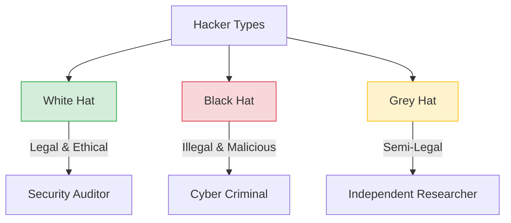
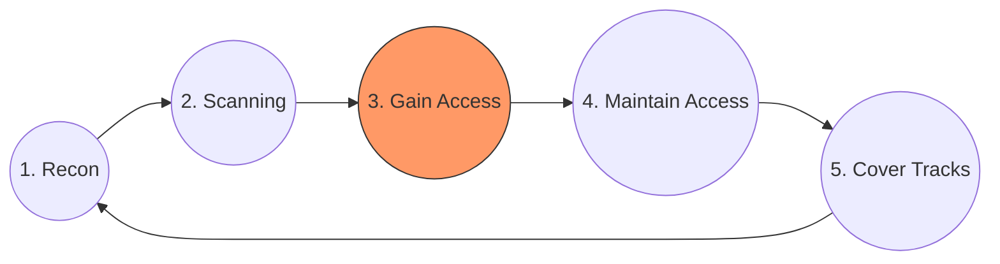

# 🛡️ Pertemuan 1: Pengenalan Ethical Hacking & Cybersecurity

**Tujuan:** Memahami konsep dasar ethical hacking dan perannya dalam keamanan siber.

---

## 📚 Materi Teori

### 1. Definisi dan Peran Ethical Hacking
Ethical Hacking adalah aktivitas mengidentifikasi kelemahan (vulnerabilities) dalam sistem komputer atau jaringan dengan izin dari pemiliknya untuk tujuan meningkatkan keamanan.
- **Tujuan Utama**: Menemukan celah sebelum dieksploitasi oleh pihak jahat.
- **Ethical Hacker**: Juga dikenal sebagai "White Hat Hacker".

### 2. Jenis Hacker
Seorang hacker dikategorikan berdasarkan niat dan legalitas aksinya:



### 3. Ethical Hacking vs Cybercrime
| Fitur    | Ethical Hacking             | Cybercrime                 |
| :------- | :-------------------------- | :------------------------- |
| Izin     | Memiliki izin resmi (Legal) | Tanpa izin (Ilegal)        |
| Motivasi | Meningkatkan keamanan       | Keuntungan pribadi/merusak |
| Metode   | Terstruktur dan dilaporkan  | Tersembunyi dan merugikan  |

### 4. Hukum & Regulasi
Penting bagi seorang ethical hacker untuk memahami batasan hukum agar tidak terjerat kasus kriminal:
- **UU ITE (Indonesia)**: Mengatur tentang akses ilegal dan perusakan data.
- **GDPR (Global)**: Regulasi perlindungan data pribadi.
- **ISO 27001**: Standar manajemen keamanan informasi.
- **NIST Framework**: Kerangka kerja keamanan siber dari AS.

### 5. Tahapan Hacking (Hacking Phases)
Proses peretasan yang terstruktur mengikuti siklus hidup berikut:



### 6. Sertifikasi Ethical Hacking
- **CEH (Certified Ethical Hacker)**: Sertifikasi dasar dari EC-Council.
- **OSCP (Offensive Security Certified Professional)**: Sertifikasi praktis tingkat lanjut.
- **PenTest+**: Sertifikasi dari CompTIA.

---

## 🛠️ Hands-on

### 1. Instalasi Kali Linux
Kali Linux adalah distribusi Linux standar industri untuk penetration testing. Anda dapat menginstalnya melalui beberapa metode:

#### A. Virtual Machine (VirtualBox/VMware)
1. Unduh file ISO/OVA dari [kali.org](https://www.kali.org/get-kali/#kali-virtual-machines).
2. Impor file ke VirtualBox/VMware.
3. Konfigurasi Network ke **Bridged** atau **NAT**.

#### B. Docker (Lingkungan Ringan)
```bash
# Pull image terbaru
docker pull kalilinux/kali-rolling

# Jalankan container secara interaktif
docker run -it kalilinux/kali-rolling /bin/bash
```

#### C. WSL 2 (Integrasi Windows)
1. Aktifkan WSL di PowerShell: `wsl --install`.
2. Instal "Kali Linux" dari Microsoft Store.

---

### 2. Simulasi Dasar Terminal
Lakukan update sistem dan instalasi alat dasar:
```bash
# Update repository
sudo apt update

# Instal Nmap (Network Mapper)
sudo apt install nmap -y

# Testing scanning dasar (Gunakan target aman!)
nmap -F scanme.nmap.org
```

---

## 📖 Referensi
- **EC-Council**: Certified Ethical Hacker (CEH) v12
- **NIST**: Cybersecurity Framework
- **OWASP**: Top 10 Security Project
- **The Web Application Hacker's Handbook** - Dafydd Stuttard
