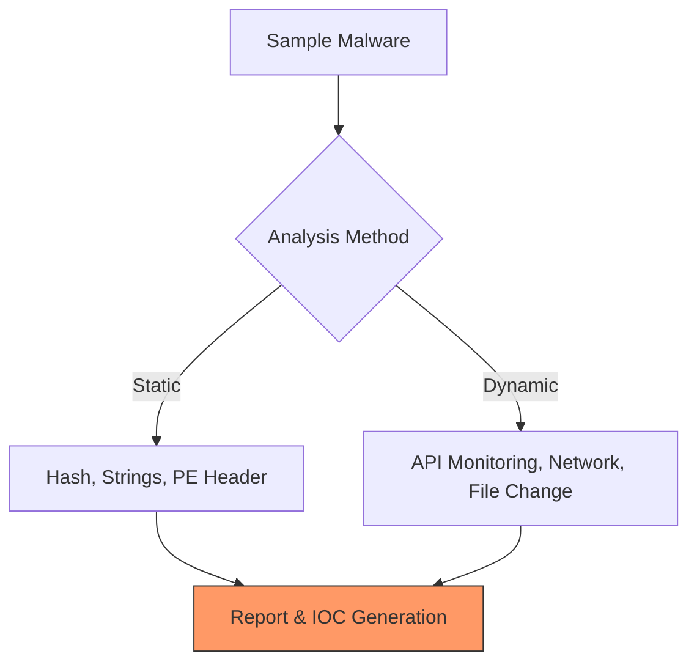

# 🛡️ Pertemuan 10: Malware Analysis & Reverse Engineering

**Tujuan:** Memahami karakteristik malware, teknik analisis statis/dinamis, serta dasar-dasar membongkar binary (Reverse Engineering).

---

## 📚 Materi Teori

### 1. Taksonomi Malware
- **Virus**: Mereplikasi diri dengan menempel pada file lain.
- **Worm**: Berpindah secara mandiri melalui jaringan.
- **Trojan**: Menyamar sebagai program berguna.
- **Ransomware**: Mengenkripsi data dan meminta tebusan.

### 2. Metode Analisis
- **Analisis Statis**: Memeriksa file tanpa menjalankannya (Strings, Hash, Header).
- **Analisis Dinamis**: Menjalankan file di lingkungan terisolasi (**Sandbox**) dan memantau perilakunya (Network traffic, API calls).



---

## 🛠️ Hands-on

### 1. Analisis Statis dengan PeStudio
PeStudio membantu mendeteksi indikator mencurigakan tanpa menjalankan malware.
- **Langkah**: Buka file `.exe` di PeStudio, periksa bagian **Indicators** dan **Strings**.
- **Cari**: Fungsi API berbahaya seperti `CreateRemoteThread` (Process Injection).

### 2. Verifikasi Hash dengan VirusTotal
Cara tercepat mendeteksi malware yang sudah dikenal.
```bash
# Menghitung MD5/SHA256 dari file mencurigakan
sha256sum suspicious.exe

# Cari hasil hash tersebut di VirusTotal (virustotal.com)
```

---

## 🔍 Dasar Reverse Engineering (RE)
RE adalah proses membongkar file binary kembali ke kode assembly atau pseudo-code.
- **Tools**: 
  - **Ghidra**: Tool RE gratis dari NSA.
  - **x64dbg**: Debugger untuk melihat jalannya aplikasi baris demi baris.

---

## 🛡️ Keamanan Lab
> [!CAUTION]
> Jangan pernah menjalankan malware di luar **Isolated Virtual Machine**. Gunakan mode **Host-Only Network** untuk mencegah penyebaran ke jaringan Anda.

---

## 🐳 Hands-on: Docker Kali Linux
Menganalisis file binary di dalam container yang terisolasi aman:
```bash
# Jalankan container
docker run -it --rm kalilinux/kali-rolling /bin/bash

# Instal tools Analisis:
apt update && apt install -y binwalk srecord strings
```

## 📖 Referensi
- **Practical Malware Analysis** - Michael Sikorski
- **Malware Archaeology**: [malwarearchaeology.com](https://www.malwarearchaeology.com/)
- **Ghidra Documentation**: [ghidra-sre.org](https://ghidra-sre.org/)
