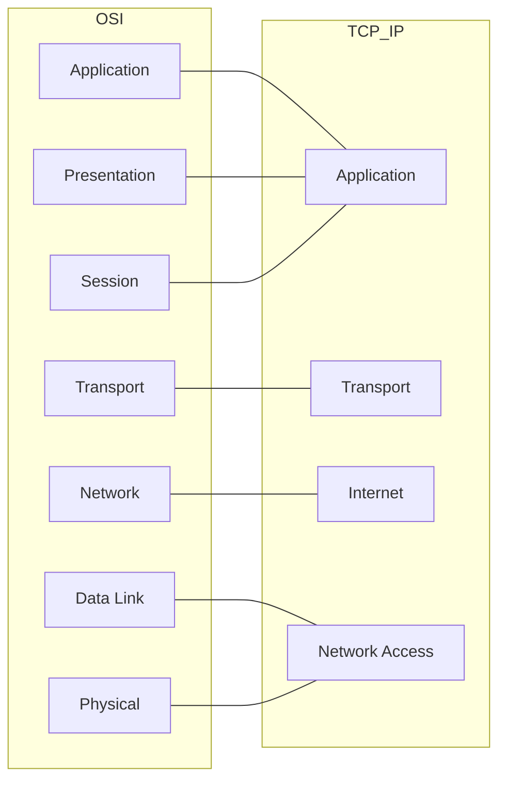

# 🛡️ Pertemuan 2: Linux & Networking Fundamentals untuk Hacking

**Tujuan:** Menguasai operasional Linux tingkat lanjut dan memahami protokol jaringan esensial yang sering menjadi target eksploitasi.

---

## 📚 Materi Teori

### 1. Networking Protocols Deep Dive
Memahami bagaimana data bergerak di jaringan:
- **DHCP (Dynamic Host Configuration Protocol)**: Proses pemberian IP secara otomatis (DORA: Discover, Offer, Request, Acknowledge).
- **DNS (Domain Name System)**: Buku telepon internet. Penting untuk teknik *DNS Spoofing*.
- **NAT (Network Address Translation)**: Menyamarkan IP Private ke IP Public. Memahami NAT penting untuk teknik *Port Forwarding*.

### 2. Model Jaringan (OSI vs TCP/IP)


### 3. Linux Internals: Process & Package Management
- **Process Management**: Setiap aplikasi berjalan sebagai "Process ID" (PID).
- **Package Management**: Kali menggunakan `apt` (Advanced Package Tool).
  - `apt search <nama>`: Mencari alat.
  - `apt install <nama>`: Memasang alat.

---

## 🛠️ Hands-on: Advanced CLI & Docker

### 1. Manajemen Proses & Hak Akses
Buka terminal Kali Linux (atau Docker) Anda:

```bash
# Melihat proses yang paling banyak memakan resource
top

# Mencari proses spesifik (misal: ssh) lalu mematikannya
ps aux | grep ssh
# sudo kill -9 <PID>

# Memahami hak akses file secara detail
ls -l /etc/shadow
# Perhatikan bahwa file sensitif hanya bisa dibaca oleh root
```

### 2. Bekerja di Background
Gunakan `&` untuk menjalankan perintah di latar belakang agar terminal tetap bisa dipakai.
```bash
# Menjalankan update di background
sudo apt update &
jobs
```

### 3. Lab Wireshark: Analisis Handshake
Wireshark bukan sekadar melihat paket, tapi memahami alur komunikasi.

**Skenario: Sniffing Login HTTP**
1. Jalankan Wireshark pada interface aktif.
2. Gunakan filter: `http.request.method == "POST"`.
3. Cari paket yang berisi path seperti `/login` atau `/auth`.
4. Klik kanan -> **Follow -> TCP Stream**.
5. **Analisis**: Temukan parameter `user` dan `pass` dalam teks terbaca. Di sinilah bahayanya protokol tidak aman (HTTP).

---

## 🛡️ Tips Lab Docker### 4. Persistence & Management (Menyimpan Pekerjaan)
Secara default, Docker container bersifat *stateless* (hilang saat ditutup).

#### A. Docker Volumes
Gunakan **Volumes** untuk menyimpan data ke komputer host secara real-time.
```bash
# Gunakan volume flag (-v)
docker run -it -v "/path/di/laptop:/work" kalilinux/kali-rolling /bin/bash
```

#### B. Docker Commit
Jika Anda ingin menyimpan seluruh perubahan lingkungan (termasuk tools yang diinstal) ke image baru:
```bash
# Di terminal host:
docker commit <container_id> kali-custom
```

### 5. Membuat Script Bash Sederhana
Otomasi tugas dasar menggunakan Bash script:
```bash
# Buat file script
nano myscript.sh

# Isi dengan:
# #!/bin/bash
# echo "Hello, Ethical Hacker!"
# uname -a

# Berikan izin eksekusi dan jalankan
chmod +x myscript.sh
./myscript.sh
```

---

## 📖 Referensi
- **The Linux Command Line** - William Shotts
- **Nmap Network Scanning** - Gordon "Fyodor" Lyon
- **NIST**: Guide to Enterprise Telework, Remote Access, and BYOD security.
- **Wireshark Tutorials**: [PacketLife.net](http://packetlife.net/library/cheat-sheets/)