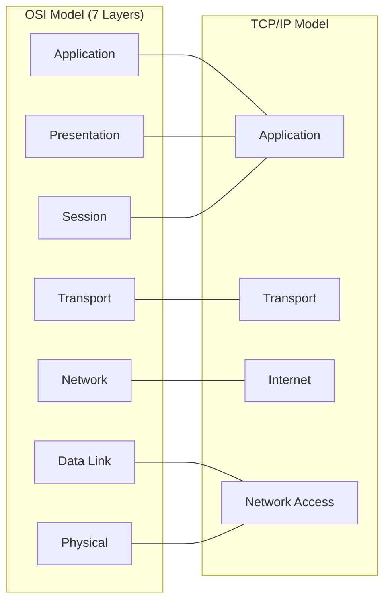

# 🛡️ Pertemuan 2: Linux & Networking Fundamentals untuk Hacking

**Tujuan:** Menguasai operasional Linux tingkat lanjut dan memahami protokol jaringan esensial yang sering menjadi target eksploitasi.

---

## 📚 Materi Teori

### 1. Networking Protocols Deep Dive
Memahami bagaimana data bergerak di jaringan adalah kunci utama seorang hacker.

| Protokol | Deskripsi                                          | Peran dalam Hacking                                 |
| :------- | :------------------------------------------------- | :-------------------------------------------------- |
| **DHCP** | Memberikan IP secara otomatis via proses **DORA**. | Bisa dieksploitasi via *DHCP Starvation*.           |
| **DNS**  | Resolusi nama domain ke IP address.                | Target utama untuk *DNS Poisoning/Spoofing*.        |
| **NAT**  | Translasi IP Private ke Public.                    | Penting dipahami untuk melakukan *Port Forwarding*. |

> [!TIP]
> **DORA Process**: Discover (Cari server), Offer (Server tawari IP), Request (Klien minta IP), Acknowledge (Server konfirmasi).

### 2. Model Jaringan (OSI vs TCP/IP)


| Layer OSI     | Fungsi Utama              | Contoh Protokol     |
| :------------ | :------------------------ | :------------------ |
| **Layer 7-5** | Interaksi User & Enkripsi | HTTP, FTP, DNS, SSL |
| **Layer 4**   | Pengiriman Antar-Host     | TCP, UDP            |
| **Layer 3**   | Routing & IP Addressing   | IP, ICMP            |
| **Layer 2-1** | Transmisi Fisik & MAC     | Ethernet, Wi-Fi     |

### 3. Linux Internals: Process & Package Management
- **Process Management**: Setiap aplikasi berjalan sebagai "Process ID" (PID).
- **Package Management**: Kali menggunakan `apt` (Advanced Package Tool).
  - `apt search <nama>`: Mencari alat.
  - `apt install <nama>`: Memasang alat.

### 4. Essential Kali Linux Commands
Sebagai Ethical Hacker, Anda harus hafal perintah dasar ini untuk efisiensi di lapangan.

| Kategori       | Perintah         | Deskripsi                                         |
| :------------- | :--------------- | :------------------------------------------------ |
| **System**     | `whoami` / `id`  | Mengetahui user aktif & hak akses.                |
|                | `uname -a`       | Informasi Kernel & Arsitektur OS.                 |
|                | `hostname -I`    | Menampilkan IP internal secara cepat.             |
| **Navigation** | `pwd`            | Menampilkan direktori saat ini.                   |
|                | `ls -la`         | List semua file (termasuk yang tersembunyi).      |
| **File Ops**   | `cp -r` / `mv`   | Copy (rekursif) atau Pindah/Rename file.          |
|                | `rm -rf`         | Hapus file/folder secara paksa (Hati-hati!).      |
|                | `cat` / `less`   | Melihat isi file (cat: semua, less: per halaman). |
| **Networking** | `ip addr`        | Konfigurasi Interface Jaringan.                   |
|                | `netstat -tunlp` | Melihat port yang sedang terbuka/listening.       |

---

## 🛠️ Hands-on: Advanced CLI & Docker

### 1. Manajemen Proses & Hak Akses
Buka terminal Kali Linux (atau Docker) Anda:

```bash
# Melihat proses yang paling banyak memakan resource
top

# Mencari proses spesifik (misal: ssh) lalu mematikannya
ps aux | grep ssh
# sudo kill -9 <PID>

# Memahami hak akses file secara detail
ls -l /etc/shadow
# Perhatikan bahwa file sensitif hanya bisa dibaca oleh root
```

### 2. Bekerja di Background
Gunakan `&` untuk menjalankan perintah di latar belakang agar terminal tetap bisa dipakai.
```bash
# Menjalankan update di background
sudo apt update &
jobs
```

### 3. Lab Wireshark: Analisis Handshake
Wireshark membantu kita melihat apa yang sebenarnya terjadi "di balik layar" kabel jaringan.

**Skenario: Sniffing Login HTTP (Insecure)**
1.  **Pilih Interface**: Buka Wireshark, pilih interface aktif (misal: eth0 atau Wi-Fi).
2.  **Mulai Sniffing**: Klik ikon sirip hiu biru untuk mulai menangkap paket.
3.  **Terapkan Filter**: Ketik filter berikut untuk mencari trafik POST (biasanya berisi login):
    ```text
    http.request.method == "POST"
    ```
4.  **Temukan Target**: Cari paket yang mengarah ke path `/login`.
5.  **Follow Stream**: Klik kanan pada paket tersebut -> **Follow** -> **TCP Stream**.
6.  **Analisis Akhir**: Perhatikan teks berwarna merah/biru. Anda akan melihat `username` dan `password` dalam bentuk teks biasa (jika situs tidak menggunakan HTTPS).

> [!WARNING]
> Selalu gunakan HTTPS untuk melindungi data sensitif dari serangan sniffing seperti ini.

---

## 🐳 Step-by-Step: Docker Kali Linux Lab
Gunakan Docker untuk menjalankan praktikum dengan fitur penyimpanan data (Persistence):

1.  **Persiapan**: Siapkan folder kosong di laptop Anda untuk menyimpan hasil lab (misal: `C:\Lab-EH`).
2.  **Jalankan Container**: Gunakan **Volume** agar file tidak hilang:
    ```bash
    docker run -it --rm -v "C:\Lab-EH:/work" kalilinux/kali-rolling /bin/bash
    ```
3.  **Update & Install**: Instal alat networking dasar:
    ```bash
    apt update && apt install -y nmap iproute2
    ```
4.  **Verifikasi**: Cek ip address di dalam container:
    ```bash
    ip addr show
    ```
5.  **Eksplorasi**: Pindah ke folder `/work` untuk mulai menyimpan file praktikum Anda.

#### B. Persistensi vs Custom Image (Docker Commit)
Jika Anda telah menginstal banyak tools dan ingin menyimpannya menjadi sebuah image baru:

1.  **Cari ID Container**: Di terminal host, jalankan `docker ps`.
2.  **Lakukan Commit**:
    ```bash
    # Format: docker commit <container_id> <nama_image_baru>
    docker commit <container_id> kali-custom-lengkap
    ```
3.  **Gunakan Image Baru**: Selanjutnya Anda bisa menjalankan `kali-custom-lengkap` tanpa perlu menginstal ulang tools.

### 5. Membuat Script Bash Sederhana
Otomasi tugas dasar menggunakan Bash script:
```bash
# Buat file script baru
nano myscript.sh

# Isi dengan baris berikut:
# #!/bin/bash            <- Shebang: Menentukan shell yang digunakan
# echo "Hello, Hacker!"  <- Perintah untuk mencetak teks
# uname -a               <- Menampilkan informasi sistem (Kernel version)

# Berikan izin eksekusi (Executable)
chmod +x myscript.sh

# Jalankan script Anda
./myscript.sh
```

## 📝 Latihan Mandiri: "The Digital Scout"
Selesaikan tantangan berikut untuk menguji pemahaman Anda tentang navigasi Linux dan networking:

1.  **Struktur Folder**: Buat folder bernama `EH-Lab` dan di dalamnya buat dua sub-folder: `reports` dan `targets`.
2.  **Manajemen File**: 
    - Buat file di dalam folder `targets` bernama `ips.txt` berisi daftar IP: `192.168.1.1`, `192.168.1.5`, `10.0.0.1`.
    - Gunakan `grep` untuk menyaring IP yang berawalan `192` lalu simpan hasilnya ke `reports/local_targets.txt`.
3.  **Proses & Background**: Jalankan perintah `sleep 500 &` (jalan di background), temukan **PID**-nya menggunakan `ps aux`, lalu matikan proses tersebut menggunakan `kill`.
4.  **Otomasi Sederhana**: Buatlah script bash bernama `netinfo.sh` di folder `EH-Lab` yang melakukan hal berikut:
    - Menampilkan teks: "Memeriksa konektivitas..."
    - Menampilkan IP Address container/host saat ini.
    - Menampilkan daftar port yang sedang *listening*.
5.  **Verifikasi**: Pastikan script tersebut bisa dijalankan dengan `./netinfo.sh`.

---
- **The Linux Command Line** - William Shotts
- **Nmap Network Scanning** - Gordon "Fyodor" Lyon
- **NIST**: Guide to Enterprise Telework, Remote Access, and BYOD security.
- **Wireshark Tutorials**: [PacketLife.net](http://packetlife.net/library/cheat-sheets/)