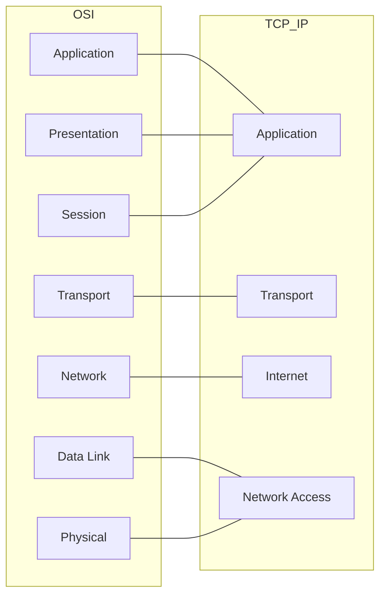

# 🛡️ Pertemuan 2: Linux & Networking Fundamentals untuk Hacking

**Tujuan:** Menguasai dasar-dasar sistem operasi dan jaringan untuk penetration testing menggunakan lingkungan virtual berbasis Docker.

---

## Materi Teori

### 1. Dasar-dasar Linux Command Line (CLI)
Linux Command Line Interface (CLI) adalah antarmuka berbasis teks untuk berinteraksi dengan sistem operasi Linux. CLI memungkinkan pengguna untuk menjalankan perintah, mengelola file, dan mengontrol sistem secara efisien.

#### Beberapa perintah dasar Linux:
- **`ls`**: Menampilkan daftar file dan direktori.
- **`cd`**: Mengubah direktori.
- **`pwd`**: Menampilkan direktori saat ini.
- **`mkdir`**: Membuat direktori baru.
- **`rm`**: Menghapus file atau direktori.
- **`cp`**: Menyalin file atau direktori.
- **`mv`**: Memindahkan atau mengganti nama file/direktori.
- **`nano`**: Editor teks sederhana di terminal.
- **`chmod`**: Mengubah izin file/direktori.
- **`sudo`**: Menjalankan perintah dengan hak akses superuser (root).
- **`grep`**: Mencari teks dalam file atau output.

---

### 2. Struktur File Linux & User Privileges
#### Struktur File Linux
Linux menggunakan struktur direktori hierarkis yang dimulai dari root (`/`):

```mermaid
graph TD
    R[/] --> bin[bin]
    R --> etc[etc]
    R --> home[home]
    R --> root_dir[root]
    R --> var[var]
    R --> usr[usr]
    
    home --> user1[user_ikhwan]
    etc --> conf[config_files]
    var --> log[log_files]
```

#### User Privileges
- **User**: Pengguna biasa dengan akses terbatas.
- **Root**: Superuser dengan akses penuh ke sistem.
- **Permissions**: Izin file/direktori (read `r`, write `w`, execute `x`).
  - Contoh: `rwxr-xr--` berarti:
    - Pemilik: baca, tulis, eksekusi (`rwx`).
    - Grup: baca, eksekusi (`r-x`).
    - Lainnya: hanya baca (`r--`).

---

#### Model OSI & TCP/IP
Perbandingan antara model referensi OSI dan implementasi praktis TCP/IP:



---

### 4. Wireshark untuk Sniffing Traffic
- **Wireshark**: Alat analisis jaringan untuk menangkap dan menganalisis paket data.
- Fitur:
  - Menangkap paket secara real-time.
  - Filter paket berdasarkan protokol, alamat IP, port, dll.
  - Analisis lalu lintas jaringan untuk keamanan.

---

### 5. Virtualization & Lab Setup dengan VMware/VirtualBox
- **Virtualisasi**: Membuat lingkungan virtual untuk menjalankan sistem operasi di dalam sistem operasi utama.
- **VMware/VirtualBox**: Perangkat lunak untuk membuat dan mengelola mesin virtual.

---

## Hands-on: Lab Kali Linux dengan Docker

Menggunakan Docker adalah cara tercepat dan teringan untuk menjalankan Kali Linux tanpa harus menginstal Virtual Machine yang berat.

### 1. Persiapan Lab (Setup Docker)
Pastikan Docker sudah terinstal di komputer host (Windows/Linux/Mac).

```bash
# 1. Unduh image Kali Linux Rolling terbaru
docker pull kalilinux/kali-rolling

# 2. Jalankan container secara interaktif (Interactive Terminal)
# --rm otomatis menghapus container saat exit
# -it memungkinkan interaksi langsung
docker run -it --rm kalilinux/kali-rolling /bin/bash
```

### 2. Konfigurasi Lingkungan (Inside Container)
Setelah masuk ke prompt `#`, lakukan inisialisasi alat dasar:

```bash
# Update repository
apt update

# Instal alat pendukung (vim/nano untuk edit file)
apt install nano -y

# Cek sistem operasi
cat /etc/os-release
```

### 3. Latihan Dasar CLI & Navigasi
Praktikkan perintah yang telah dipelajari di teori:

```bash
# Navigasi dan pembuatan folder
pwd
ls -la
mkdir lab_hacking
cd lab_hacking

# Bermain dengan file
echo "Rahasia Negara" > rahasia.txt
cat rahasia.txt

# Mengubah izin file (chmod)
# Buat file hanya bisa dibaca pemilik
chmod 400 rahasia.txt
ls -l rahasia.txt
# Coba baca file (berhasil)
cat rahasia.txt
# Coba tulis ulang (akan error 'Permission denied')
echo "Ubah" > rahasia.txt
```

### 4. Persistence (Menyimpan Pekerjaan)
Secara default, Docker container bersifat *stateless* (hilang saat ditutup). Gunakan **Volumes** untuk menyimpan data ke komputer host.

```bash
# Jalankan Docker dengan mounting folder lokal ke container
# Ganti 'C:\Users\Documents\Hacking' dengan path folder Anda
docker run -it -v "C:\Users\ikhwa\Documents\EH-Lab:/work" kalilinux/kali-rolling /bin/bash

# Di dalam container, folder ada di /work
cd /work
touch hasil_lab.txt
```

---

## 🛠️ Analisis Jaringan dengan Wireshark

Wireshark adalah alat analisis protokol jaringan terbaik di dunia yang memungkinkan Anda melihat apa yang terjadi di jaringan Anda pada tingkat mikroskopis.

### 1. Instalasi di Berbagai Platform
- **Kali Linux**: Biasanya sudah terinstal secara default. Jika belum:
  ```bash
  sudo apt update && sudo apt install wireshark -y
  ```
- **Windows**: Unduh installer `.exe` dari [wireshark.org](https://www.wireshark.org/download.html). Pastikan menginstal **Npcap** saat proses instalasi.
- **macOS**: Instal via Homebrew dengan perintah `brew install --cask wireshark`.

### 2. Dasar-Dasar Sniffing
- **Promiscuous Mode**: Pastikan ini aktif agar Wireshark dapat menangkap semua paket di segmen jaringan, bukan hanya yang ditujukan untuk komputer Anda.
- **Capture Filter (BPF Syntax)**: Digunakan *sebelum* mulai capture untuk membatasi data yang masuk.
  - `host 192.168.1.1`: Hanya trafik dari/ke IP tersebut.
  - `port 80`: Hanya trafik HTTP.
  - `net 192.168.1.0/24`: Seluruh subnet.

### 3. Display Filter (Post-Capture)
Digunakan *setelah* data tertangkap untuk mempermudah analisis.
- `http.request.method == "POST"`: Mencari data yang dikirim (biasanya berisi password/form).
- `dns.flags.response == 0`: Melihat query DNS yang keluar.
- `tcp.flags.syn == 1 and tcp.flags.ack == 0`: Mendeteksi upaya inisiasi koneksi (sering digunakan dalam port scanning).
- `frame contains "password"`: Mencari string teks spesifik di seluruh paket.

### 4. Praktik: Mengintip Data Plaintext
Banyak protokol lama tidak terenkripsi. Berikut cara melihat isinya:
1. Jalankan Capture pada interface yang aktif.
2. Filter dengan `http` atau `ftp`.
3. Klik kanan pada paket yang menarik -> **Follow** -> **TCP Stream**.
4. Wireshark akan merekonstruksi seluruh percakapan. Jika target login ke situs HTTP biasa, Anda akan melihat `username` dan `password` dalam teks biasa.

### 5. Sumber Belajar & Referensi Resmi
- **Wireshark User's Guide**: [Dokumentasi Resmi](https://www.wireshark.org/docs/wsug_html_chunked/)
- **Wireshark Wiki**: Contoh file `.pcap` untuk latihan [SampleCaptures](https://wiki.wireshark.org/SampleCaptures)
- **SharkFest**: Kumpulan presentasi teknik analisis tingkat lanjut [SharkFest Retrospective](https://sharkfestus.wireshark.org/retrospective)

---

## 📖 Referensi
- **The Linux Command Line** - William Shotts
- **Nmap Network Scanning** - Gordon "Fyodor" Lyon
- **Docker Documentation**: [https://docs.docker.com/](https://docs.docker.com/)
- **Kali Linux Docker**: [https://www.kali.org/docs/containers/using-kali-docker-images/](https://www.kali.org/docs/containers/using-kali-docker-images/)