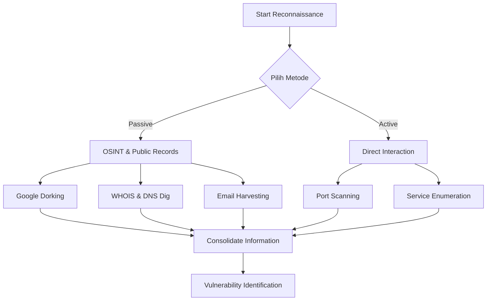

# 🛡️ Pertemuan 3: Passive & Active Reconnaissance (Footprinting)

**Tujuan:** Menguasai teknik pengumpulan informasi target secara mendalam menggunakan metodologi OSINT dan alat reconnaissance aktif untuk membangun profil target yang komprehensif.

---

## 📚 Materi Teori

### 1. OSINT Framework & Metodologi
OSINT (Open Source Intelligence) adalah data yang dikumpulkan dari sumber terbuka. Framework OSINT membantu hacker mengategorikan pencarian berdasarkan:
- **Username**: Mencari akun di berbagai platform (misal: Sherlock).
- **Email Address**: Mencari kebocoran data (HaveIBeenPwned).
- **Domain Name**: Enumerasi subdomain dan sertifikat SSL.
- **IP Address**: Mencari lokasi fisik dan hosting provider.

### 2. Google Dorking (Advanced Search)
Teknik menggunakan operator khusus untuk menemukan informasi yang tidak sengaja terekspos.

| Operator    | Fungsi                             | Contoh                         |
| ----------- | ---------------------------------- | ------------------------------ |
| `site:`     | Membatasi hasil ke domain tertentu | `site:target.com`              |
| `filetype:` | Mencari ekstensi file spesifik     | `site:target.com filetype:pdf` |
| `intitle:`  | Mencari kata di judul halaman      | `intitle:"index of"`           |
| `inurl:`    | Mencari kata di URL                | `inurl:admin.php`              |
| `"text"`    | Mencari frase eksak                | `"password list"`              |

**Contoh Dork Populer**:
- Menemukan direktori terbuka: `intitle:"index of" "parent directory"`
- Menemukan file log: `filetype:log "error"`
- Menemukan file konfigurasi: `extension:config inurl:web.config`

### 3. DNS Deep Dive (Enumeration)
Sistem Nama Domain menyimpan banyak informasi infrastruktur. Record penting yang harus diperiksa:
- **A Record**: Memetakan domain ke alamat IPv4.
- **AAAA Record**: Memetakan domain ke alamat IPv6.
- **MX Record**: Menunjukkan mail server (berguna untuk email harvesting).
- **TXT Record**: Sering berisi informasi verifikasi (SPF, DKIM) yang membocorkan layanan pihak ketiga.
- **NS Record**: Authoritative name servers untuk domain tersebut.

### 4. Alur Kerja Reconnaissance



---

## 🛠️ Hands-on

### 1. Email Harvesting dengan `theHarvester`
Alat ini mengumpulkan email, subdomain, dan IP dari berbagai public data sources (Google, Bing, LinkedIn).
```bash
# Mencari email dan subdomain dari Google untuk target.com
theHarvester -d target.com -b google -l 500
```

### 2. Metadata Extraction dengan `Exiftool`
Metadata dalam gambar atau dokumen dapat membocorkan versi software, koordinat GPS, hingga username pembuat file.
```bash
# Melihat metadata file gambar
exiftool sample_image.jpg

# Menghapus seluruh metadata (Anti-forensics)
exiftool -all= sample_image.jpg
```

### 3. Advanced DNS Recon dengan `dig`
```bash
# Menampilkan seluruh record DNS target
dig target.com ANY

# Mencari tahu mail server target
dig target.com MX
```

### 4. Shodan Query Filters
Shodan adalah "Google for devices". Gunakan filter untuk hasil presisi:
- `city:"Jakarta"`: Berdasarkan lokasi.
- `port:21`: Mencari server FTP.
- `product:"Apache"`: Berdasarkan versi software.
- `os:"Windows 7"`: Mencari sistem operasi jadul yang rentan.

---

## 🔍 Case Study: OSINT Workflow
1. **Identifikasi Domain Utama**: Temukan IP dan kepemilikan via `whois`.
2. **Enumerasi Subdomain**: Gunakan `subfinder` atau `amass` untuk menemukan `dev.target.com` atau `staging.target.com`.
3. **Pencarian File Sensitif**: Gunakan Google Dorking mencari file `.env` atau `.bak`.
4. **Profil Karyawan**: Cari nama dan jabatan di LinkedIn untuk simulasi Social Engineering.
5. **Analisis Infrastruktur**: Gunakan Shodan untuk melihat port yang terbuka tanpa di-scan secara aktif.

---

## 📖 Referensi
- **OSINT Framework**: [https://osintframework.com/](https://osintframework.com/)
- **Google Hacking Database (GHDB)**: [Exploit-DB Dorks](https://www.exploit-db.com/google-hacking-database)
- **Kali Linux Tools Documentation**: [https://www.kali.org/tools/](https://www.kali.org/tools/)
- **The Art of Invisibility** - Kevin Mitnick
