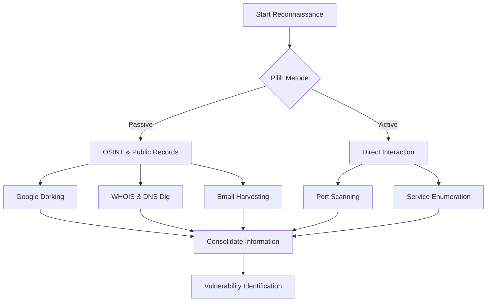

# 🛡️ Pertemuan 3: Passive & Active Reconnaissance (Footprinting)

**Tujuan:** Menguasai teknik pengumpulan informasi target secara mendalam menggunakan metodologi OSINT dan alat reconnaissance aktif untuk membangun profil target yang komprehensif.

---

## 📚 Materi Teori

### 1. OSINT Framework & Metodologi
OSINT (Open Source Intelligence) adalah data yang dikumpulkan dari sumber terbuka. Framework OSINT membantu hacker mengategorikan pencarian berdasarkan:
- **Username**: Mencari akun di berbagai platform (misal: Sherlock).
- **Email Address**: Mencari kebocoran data (HaveIBeenPwned).
- **Domain Name**: Enumerasi subdomain dan sertifikat SSL.
- **IP Address**: Mencari lokasi fisik dan hosting provider.

### 2. Google Dorking (Advanced Search)
Teknik menggunakan operator khusus untuk menemukan informasi yang tidak sengaja terekspos.

| Operator    | Fungsi                             | Contoh                         |
| ----------- | ---------------------------------- | ------------------------------ |
| `site:`     | Membatasi hasil ke domain tertentu | `site:target.com`              |
| `filetype:` | Mencari ekstensi file spesifik     | `site:target.com filetype:pdf` |
| `intitle:`  | Mencari kata di judul halaman      | `intitle:"index of"`           |
| `inurl:`    | Mencari kata di URL                | `inurl:admin.php`              |
| `"text"`    | Mencari frase eksak                | `"password list"`              |

**Contoh Dork Populer**:
- Menemukan direktori terbuka: `intitle:"index of" "parent directory"`
- Menemukan file log: `filetype:log "error"`
- Menemukan file konfigurasi: `extension:config inurl:web.config`

### 3. DNS Deep Dive (Enumeration)
Sistem Nama Domain menyimpan banyak informasi infrastruktur. Record penting yang harus diperiksa:
- **A Record**: Memetakan domain ke alamat IPv4.
- **AAAA Record**: Memetakan domain ke alamat IPv6.
- **MX Record**: Menunjukkan mail server (berguna untuk email harvesting).
- **TXT Record**: Sering berisi informasi verifikasi (SPF, DKIM) yang membocorkan layanan pihak ketiga.
- **NS Record**: Authoritative name servers untuk domain tersebut.

### 4. Alur Kerja Reconnaissance


```mermaid
graph TD
    A[Start Reconnaissance] --> B{Pilih Metode}
    B -->|Passive| C[OSINT & Public Records]
    B -->|Active| D[Direct Interaction]
    
    C --> C1[Google Dorking]
    C --> C2[WHOIS & DNS Dig]
    C --> C3[Email Harvesting]
    
    D --> D1[Port Scanning]
    D --> D2[Service Enumeration]
    
    C1 & C2 & C3 & D1 & D2 --> E[Consolidate Information]
    E --> F[Vulnerability Identification]
```

---

## 🐳 Step-by-Step: Docker Kali Linux Lab

### A. Menjalankan Kali Linux di Docker

#### 1. Install Docker (Jika Belum Ada)
```bash
# Untuk Ubuntu/Debian
sudo apt update
sudo apt install docker.io -y
sudo systemctl start docker
sudo systemctl enable docker

# Verifikasi instalasi
docker --version
```

#### 2. Pull Image Kali Linux
```bash
# Download image Kali Linux terbaru
docker pull kalilinux/kali-rolling

# Lihat image yang tersedia
docker images
```

#### 3. Jalankan Container Kali Linux
```bash
# Jalankan container dengan akses interaktif
docker run -it --name kali-recon kalilinux/kali-rolling /bin/bash

# Atau langsung hapus setelah selesai (--rm)
docker run -it --rm kalilinux/kali-rolling /bin/bash
```

#### 4. Update dan Install Tools Dasar
```bash
# Update package list
apt update && apt upgrade -y

# Install tools dasar untuk reconnaissance
apt install -y whois dnsutils theharvester sublist3r nmap whatweb exiftool fping dnsrecon

# Verifikasi instalasi
whois --version
nmap --version
theharvester --help
```

#### 5. Membuat Workspace
```bash
# Buat direktori kerja
mkdir /root/recon
cd /root/recon

# Buat file untuk menyimpan hasil
touch hasil_scan.txt
```

#### 6. Menyimpan dan Keluar Container
```bash
# Keluar dari container (container tetap berjalan)
# Tekan: Ctrl+P, Ctrl+Q

# Kembali ke container
docker attach kali-recon

# Hentikan container
docker stop kali-recon

# Jalankan ulang container yang sudah ada
docker start -ai kali-recon
```

#### 7. Copy File dari Container ke Host
```bash
# Dari host (bukan dari dalam container)
docker cp kali-recon:/root/recon/hasil_scan.txt ./hasil_scan.txt
```

### B. Docker Commands Penting untuk Praktikum

```bash
# Lihat container yang sedang berjalan
docker ps

# Lihat semua container (termasuk yang berhenti)
docker ps -a

# Hapus container
docker rm kali-recon

# Hapus image
docker rmi kalilinux/kali-rolling

# Jalankan container dengan shared folder
docker run -it -v /home/user/recon:/recon --name kali-recon kalilinux/kali-rolling /bin/bash
```

### C. Troubleshooting Docker

```bash
# Jika error permission denied
sudo usermod -aG docker $USER
# Logout dan login kembali

# Jika container tidak bisa internet
docker run -it --rm --network host kalilinux/kali-rolling /bin/bash

# Jika apt update error
echo "nameserver 8.8.8.8" > /etc/resolv.conf
```

---

## 🛠️ Hands-on Praktis di Docker Kali Linux

### 1. Information Gathering Dasar

#### WHOIS Lookup
```bash
# Di dalam container Kali
whois google.com
whois facebook.com > /root/recon/whois_target.txt
```

#### DNS Enumeration dengan DIG
```bash
# Cek berbagai record DNS
dig google.com ANY +short
dig google.com MX +short
dig google.com NS +short
dig google.com TXT +short

# Reverse lookup
dig -x 8.8.8.8
```

### 2. Subdomain Discovery

#### Menggunakan DNSRecon
```bash
# Basic enumeration
dnsrecon -d google.com

# Bruteforce subdomain dengan wordlist sederhana
cat > /root/recon/wordlist.txt << EOF
www
mail
ftp
admin
dev
blog
api
test
EOF

dnsrecon -d google.com -D /root/recon/wordlist.txt -t brt
```

#### Menggunakan Sublist3r
```bash
# Scan subdomain
sublist3r -d google.com

# Simpan output
sublist3r -d google.com -o /root/recon/subdomain.txt
```

### 3. Email Harvesting

#### TheHarvester
```bash
# Cari email dari berbagai sumber
theHarvester -d google.com -b google -l 50
theHarvester -d google.com -b bing -l 50
```

### 4. Metadata Extraction

#### Exiftool untuk File
```bash
# Download sample file
cd /root/recon
wget https://www.w3.org/WAI/ER/tests/xhtml/testfiles/resources/pdf/dummy.pdf -O sample.pdf

# Lihat metadata
exiftool sample.pdf

# Hapus metadata
exiftool -all= sample.pdf
```

### 5. Active Reconnaissance Dasar

#### Port Scanning dengan Nmap
```bash
# Scan basic
nmap scanme.nmap.org

# Scan dengan deteksi service
nmap -sV scanme.nmap.org

# Scan port tertentu
nmap -p 80,443,22 scanme.nmap.org
```

#### Web Technology Detection
```bash
# Deteksi teknologi website
whatweb google.com
whatweb scanme.nmap.org
```

---

## 🔍 Case Study: OSINT Workflow Lengkap di Docker

### Target: Contoh Perusahaan (contoh.com)

**Langkah 1: Setup Workspace**
```bash
# Di dalam container
mkdir -p /root/recon/target
cd /root/recon/target
```

**Langkah 2: Informasi Domain**
```bash
whois contoh.com > whois.txt
dig contoh.com ANY +short > dns_records.txt
echo "DNS Enumeration selesai" | tee -a report.txt
```

**Langkah 3: Cari Subdomain**
```bash
sublist3r -d contoh.com -o subdomains.txt
cat subdomains.txt
```

**Langkah 4: Cari Email**
```bash
theHarvester -d contoh.com -b google -l 50 > emails.txt
```

**Langkah 5: Cek Teknologi**
```bash
whatweb contoh.com > technology.txt
nmap -sV contoh.com > services.txt
```

**Langkah 6: Buat Report**
```bash
# Gabungkan semua hasil
echo "=== RECON REPORT ===" > final_report.txt
echo "Tanggal: $(date)" >> final_report.txt
echo "" >> final_report.txt
echo "--- WHOIS ---" >> final_report.txt
cat whois.txt >> final_report.txt
echo "" >> final_report.txt
echo "--- SUBDOMAINS ---" >> final_report.txt
cat subdomains.txt >> final_report.txt
echo "" >> final_report.txt
echo "--- EMAILS ---" >> final_report.txt
cat emails.txt >> final_report.txt

# Lihat report
cat final_report.txt
```

**Langkah 7: Copy Report ke Host**
```bash
# Dari terminal host (bukan dari container)
docker cp kali-recon:/root/recon/target/final_report.txt ./final_report.txt
```

---

## 📝 Cheatsheet Perintah Docker

```bash
# Menjalankan container baru
docker run -it --rm kalilinux/kali-rolling /bin/bash

# Menjalankan container dengan nama
docker run -it --name kali-recon kalilinux/kali-rolling /bin/bash

# Masuk ke container yang sudah ada
docker exec -it kali-recon /bin/bash

# Copy file dari container ke host
docker cp container_name:/path/file ./destination/

# Copy file dari host ke container
docker cp ./file.txt container_name:/path/

# Menyimpan container sebagai image baru
docker commit kali-recon kali-recon-image

# Melihat resource usage
docker stats
```

---

## ⚠️ Cat Penting

1. **Gunakan untuk pembelajaran dan pengujian yang sah**
2. **Jangan gunakan pada domain tanpa izin**
3. **Container akan hilang jika tidak di-commit (kecuali pakai --rm)**
4. **Simpan hasil scan dengan copy ke host**
5. **Beberapa tools mungkin butuh API key untuk hasil maksimal**

---

## 📖 Referensi

- **OSINT Framework**: [https://osintframework.com/](https://osintframework.com/)
- **Google Hacking Database (GHDB)**: [https://www.exploit-db.com/google-hacking-database](https://www.exploit-db.com/google-hacking-database)
- **Kali Linux Tools**: [https://www.kali.org/tools/](https://www.kali.org/tools/)
- **Docker Documentation**: [https://docs.docker.com/](https://docs.docker.com/)
- **The Art of Invisibility** - Kevin Mitnick
