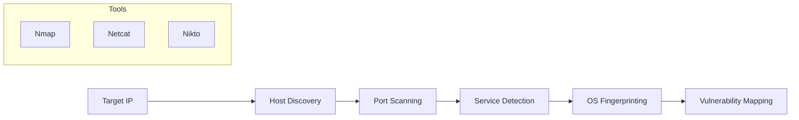

# 🛡️ Pertemuan 4: Scanning & Enumeration

**Tujuan:** Mengidentifikasi layanan aktif, port terbuka, dan kemungkinan kerentanan pada target.

---

## 📚 Materi Teori

### 1. Host Discovery & Network Mapping
Sebelum melakukan port scanning, kita perlu memastikan target "hidup".

- **Ping (ICMP Discover)**:
  ```bash
  ping -c 4 target.com
  ```
- **Traceroute**: Melacak hops yang dilalui paket.
  ```bash
  traceroute target.com
  ```
- **ARP Scan** (Untuk jaringan lokal):
  ```bash
  sudo arp-scan -l
  ```

### 2. Nmap untuk Scanning Jaringan
Nmap (Network Mapper) adalah standar industri untuk pemetaan jaringan.
- **Host Discovery**: Menentukan komputer mana yang aktif dalam jaringan.
- **Port Scanning**: Mengetahui port TCP/UDP yang terbuka (Open/Closed/Filtered).
- **Service & OS Detection**: Menebak versi aplikasi dan sistem operasi target.

### 3. Alur Scanning & Enumeration
Proses ini bertujuan untuk "mempersempit" serangan dari alamat IP ke layanan spesifik yang rentan.



### 3. Enumerasi Layanan (Netcat & Enum4linux)
- **Netcat (nc)**: Digunakan untuk "Banner Grabbing" (mengambil identitas layanan saat terkoneksi).
- **Enum4linux**: Sangat efektif untuk mengumpulkan informasi dari sistem Windows/SMB (user, share list, kebijakan password).

### 4. Web Scanning (Nikto & Dirb)
- **Nikto**: Menscan web server untuk file sensitif dan konfigurasi yang salah.
- **Dirb**: Brute-force direktori tersembunyi (misal: `/admin`, `/config`).

---

## 🛠️ Hands-on

### 1. Nmap Mastery
Lakukan scanning dengan berbagai opsi:
```bash
# Scan cepat 100 port populer
nmap -F <target_IP>

# Scan deteksi servis dan OS (Intensif)
nmap -sV -O <target_IP>

# Scan seluruh subnet
nmap 192.168.1.0/24
```

### 2. Banner Grabbing & SMB Enumeration
```bash
# Mengambil banner layanan di port 80
nc -v <target_IP> 80

# Enumerasi SMB (Jika port 445 terbuka)
enum4linux -a <target_IP>
```

---

## 🐳 Hands-on: Docker Kali Linux
Gunakan Docker untuk scanning jaringan (Gunakan `--net=host` agar bisa akses jaringan host):
```bash
# Jalankan container dengan akses jaringan host
docker run -it --rm --net=host kalilinux/kali-rolling /bin/bash

# Instal tools Scanning:
apt update && apt install -y nmap netcat-traditional nikto
```

## 📖 Referensi
- **Nmap Network Scanning** - Gordon "Fyodor" Lyon
- **Nmap Official Documentation**: [https://nmap.org/book/](https://nmap.org/book/)
- **Enum4linux project**: [https://github.com/CiscoCXSecurity/enum4linux](https://github.com/CiscoCXSecurity/enum4linux)
