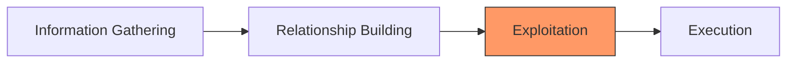

# 🛡️ Pertemuan 9: Social Engineering Attacks

**Tujuan:** Memahami teknik manipulasi psikologis untuk mendapatkan informasi sensitif dan mensimulasikan serangan phishing secara etis.

---

## 📚 Materi Teori

### 1. Apa itu Social Engineering?
Social Engineering adalah seni memanipulasi orang agar memberikan informasi rahasia. Hacker menargetkan "Human Link" yang seringkali menjadi titik terlemah dalam keamanan.

### 2. Jenis-jenis Serangan
- **Phishing**: Mengirim email palsu massal.
- **Spear Phishing**: Target spesifik (misal: Manager Keuangan).
- **Vishing (Voice Phishing)**: Melalui telepon.
- **Smishing (SMS Phishing)**: Melalui pesan teks.
- **Baiting**: Meninggalkan USB drive terinfeksi di tempat umum.

### 3. Siklus Serangan Social Engineering


---

## 🛠️ Hands-on: Social Engineering Toolkit (SET)

SET adalah framework open-source yang dirancang khusus untuk simulasi serangan social engineering.

### 1. Menjalankan SET
```bash
sudo setoolkit
```

### 2. Skenario: Credential Harvester (Phishing)
Kita akan membuat kloning situs (misal: Facebook atau LinkedIn) untuk mencuri kredensial.

1. Pilih: `1) Social-Engineering Attacks`
2. Pilih: `2) Website Attack Vectors`
3. Pilih: `3) Credential Harvester Attack Method`
4. Pilih: `2) Site Cloner`
5. Masukkan IP mesin penyerang (Kali Linux Anda).
6. Masukkan URL yang akan dikloning: `https://facebook.com`

---

## 🛡️ Cara Pencegahan
- **Edukasi Karyawan**: Pelatihan awareness secara rutin.
- **Multi-Factor Authentication (MFA)**: Kredensial saja tidak cukup jika ada lapisan kedua.
- **Anti-Spam/Phishing Filters**: Menggunakan AI untuk mendeteksi email mencurigakan.

---

## 📖 Referensi
- **Social Engineering Framework**: [social-engineer.org](https://www.social-engineer.org/framework/se-framework-introduction/)
- **TrustedSec (SET Creator)**: [Social-Engineer Toolkit Documentation](https://github.com/trustedsec/social-engineer-toolkit)
- **Social Engineering: The Science of Human Hacking** - Christopher Hadnagy
